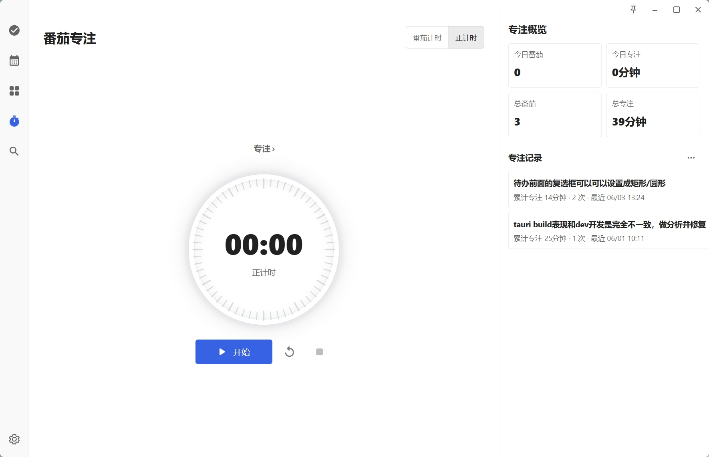
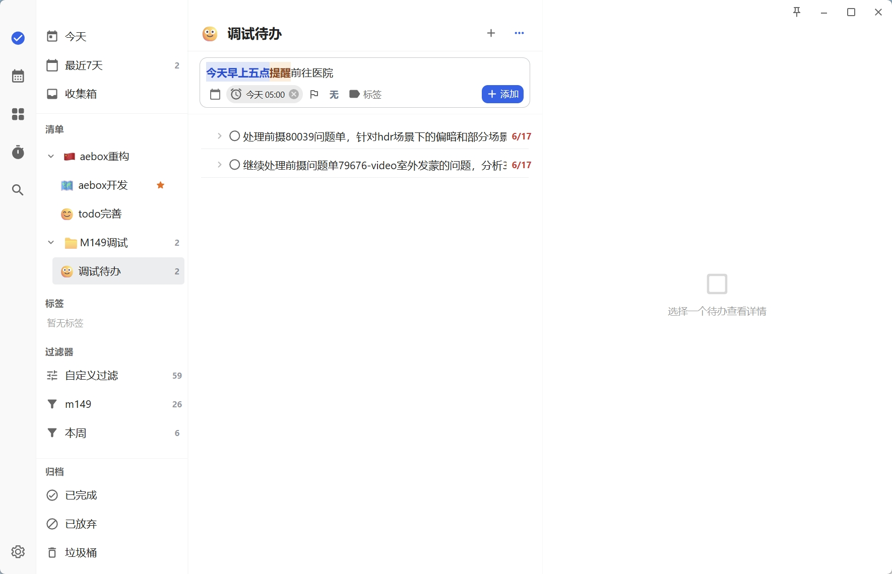

 

 

 
## Development

```bash
npm install
npm run tauri dev
```

Frontend-only build:

```bash
npm run build
```

Tauri build:

```bash
npm run tauri build
```

## Data

Runtime data is stored under the resolved base directory:

- `app_cache/todo/todos.sqlite`
- `app_cache/todo/settings.json`
- `app_cache/todo/backups/`
- `app_cache/todo/assets/`


Custom fonts can be placed in:

```text
resource/fonts/
```

